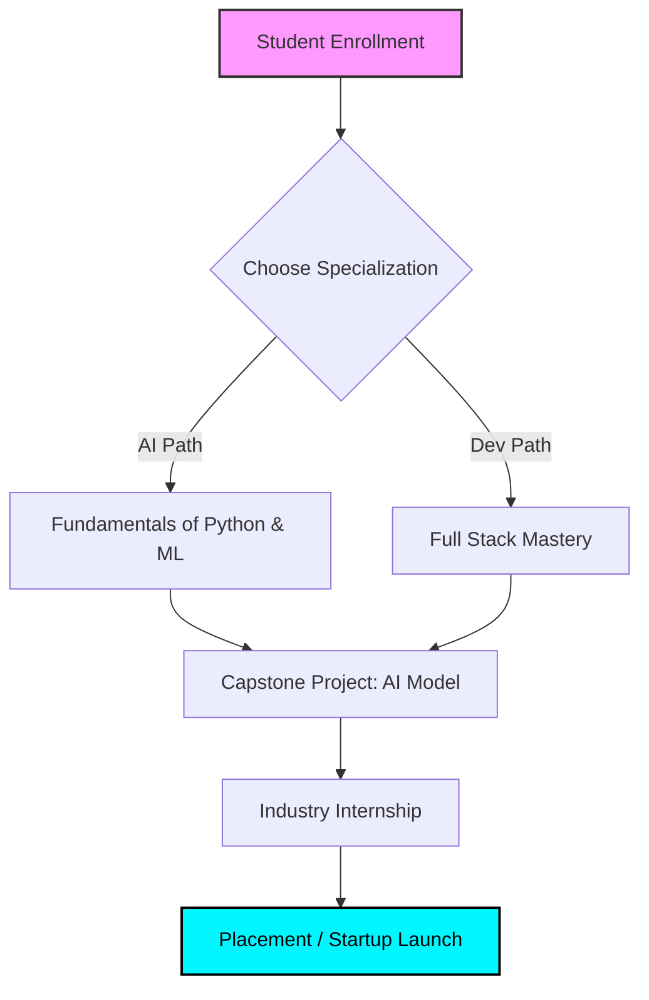

# 🚀 TARKAI EDTECH PVT. LTD.
### *Building the Future with AI, Innovation & Education*

  <a href="#-about-tarkai">About Us</a> •
  <a href="#-our-offerings">Programs</a> •
  <a href="#-tech-stack">Technologies</a> •
  <a href="#-the-tarkai-roadmap">Roadmap</a> •
  <a href="#-connect-with-us">Contact</a>

---

# 👨‍💼 Founder's Vision

### **Sahil**
**Founder & Visionary of TarkAI EdTech Pvt. Ltd.**

> “Our mission is to make future technologies accessible, practical, and industry-ready for every student. We don't just teach code; we cultivate the mindset of an innovator.”

---

# 🌟 About TarkAI EdTech

**TarkAI EdTech Pvt. Ltd.** is an innovative AI-focused educational ecosystem. We bridge the gap between traditional academic learning and the rapidly evolving tech industry. 

At TarkAI, students don't just consume content—they **build**, **innovate**, and **launch** real-world AI solutions.

### 🎯 Our Mission
*   **Practicality First:** Moving beyond theory to hands-on project building.
*   **Industry Alignment:** Training students for the skills companies actually need.
*   **Entrepreneurship:** Encouraging students to turn their AI projects into startups.
*   **Modern Ecosystem:** Providing a platform where technology meets creativity.

---

# 🚀 Our Offerings

<table border="0">
<tr>
<td width="50%" valign="top">

### 📚 Professional Courses
- 🤖 **AI/ML Architect Program**
- 📊 **Data Science & Strategic Analytics**
- 💻 **Full Stack Development**
- 🧠 **Prompt Engineering (Generative AI)**
- ☁️ **Cloud & DevOps**
- 📈 **Business Analytics**
- 🛡️ **Cyber Security**
- 🎨 **UI/UX Designing**

</td>
<td width="50%" valign="top">

### 🏆 Student Development
- **Live Projects:** Real-world enterprise case studies.
- **Hackathons:** Competitive coding & problem solving.
- **Startup Guidance:** Mentorship for budding founders.
- **Internships:** Hands-on experience with internal tools.
- **Placement Assistance:** Resume building & mock interviews.
- **AI Workshops:** Weekend deep-dives into new tech.

</td>
</tr>
</table>

---

# 🧠 Tech Stack & Ecosystem

### 🌐 Development & Design

### 🤖 Artificial Intelligence & Data

### 🛠️ Tools & DevOps

---

# 🛣️ The TarkAI Learning Roadmap

Focus Areas:
  - Artificial Intelligence: "Deep Learning, NLP, Computer Vision"
  - Development: "Scalable Web & Mobile Architectures"
  - Career: "Mentorship & Corporate Readiness"
  - Innovation: "Incubating Student Startups"
  - Automation: "Workflow efficiency using AI agents"
